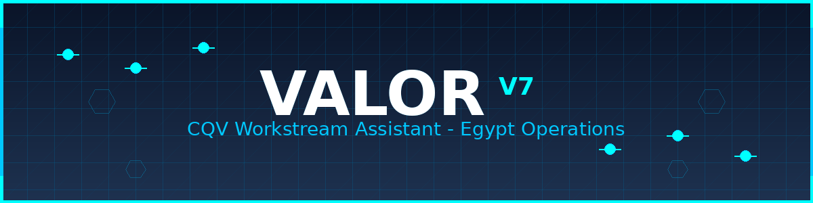

# Valor – Egypt Operations Site

This repository hosts **Valor V7**, a CQV workstream assistant tailored for a multi‑national company’s Egypt operations site.  It packages the layered logic, state machines, work‑package engines, security overlays and export pipelines required to run the Valor assistant in production.

## Directory structure

The repository is organized into logical top‑level folders to keep content discoverable:

- **instructions/** – core user‑facing instructions and onboarding logic.
- **system/** – system‑level operational logic including the role definition, rules, state machine, tone model, command logic, security overlays and ID numbering.
- **knowledge/** – reference material such as R/S logic, WP libraries and examples.
- **templates/** – export templates (CSV) for formal work‑package output.
- **evals/** – concrete evaluation scenarios used to validate mode transitions, command processing, security enforcement, WP lifecycle and export generation.
- **documentation/** – supplementary documentation including the changelog, contribution guidelines, index and other supporting files.
- **data/** – configuration and metadata files used by the assistant.

For a detailed list of every file, see `documentation/INDEX.md`.

## Usage

Clone or download this repository, keep the directory structure intact and load it into the target environment that will host the Valor assistant.  The assistant is intended to operate as a CQV consultant, focusing on the Egypt site, and relies on the provided configuration and knowledge files to function correctly.